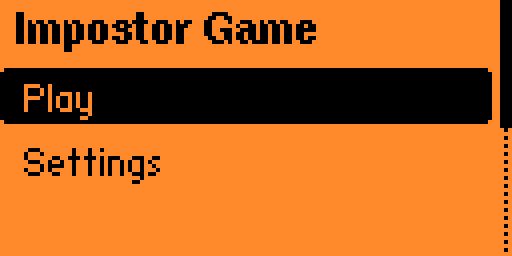
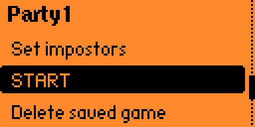

# Impostor Game

**Flipper Zero** external application (**FAP**). Install it on the **microSD** of your Flipper and run it from **Apps → Games → Impostor Game**. It is a **device-only** party helper: you do not need a phone or PC during the game.

Inspired by **Undercover** / **Spyfall** style play: everyone except the impostors sees the same secret word; impostors see the same hint about that word. Roles and reveal order are randomized each session.

## Screenshots

### Main menu

### Saved game preset

Edit players, impostor count, **START** the round, or delete the saved slot.

### Remove player

Pick a name to remove from the current roster.

### Pass the device

Current player hands the Flipper to the next person; **hold OK** to see the role card.

### Role cards

Crew sees the shared **word**; impostors see a **hint** only. **Short OK** advances to the next player.

| Crew (word) | Impostor (hint) |
|-------------|-----------------|
|  |  |

### First speaker

After everyone has seen their role, the app picks who speaks first at random.

## Features

- **English** UI by default, **Spanish** second locale (stored on SD).
- **Main menu**: **Play** (list of saved games + create new), **Settings** (language + credits).
- **New game**: session name, then player names (add, edit, remove), **choose impostors** (valid range **1 … players−2**; suggested ~**25%** marked with `*`), then play. Up to **64** players.
- **Saved games**: edit players and impostor count before starting, or delete a saved game from the preset screen.
- **Play flow**: READY → pass device → **hold OK** to reveal role → **short OK** to continue → when everyone has seen roles, **START** with random first speaker.
- **Word bank**: bilingual pairs in flash; one word index per game session.

## Install on Flipper Zero

1. Build or download the `.fap` for this app.
2. Copy `flipper_impostor_game.fap` to the SD card, for example `apps/Games/` (or your preferred layout supported by the firmware).
3. On the Flipper: **Apps → Games → Impostor Game**.

## Build

- **Host tests**: `make test` (GCC, no Flipper SDK).
- **FAP**: set `FLIPPER_FIRMWARE_PATH` to your firmware checkout, then `make prepare` and `make fap`.

## Requirements

- [flipperzero-firmware](https://github.com/flipperdevices/flipperzero-firmware) and `./fbt` for device builds.
